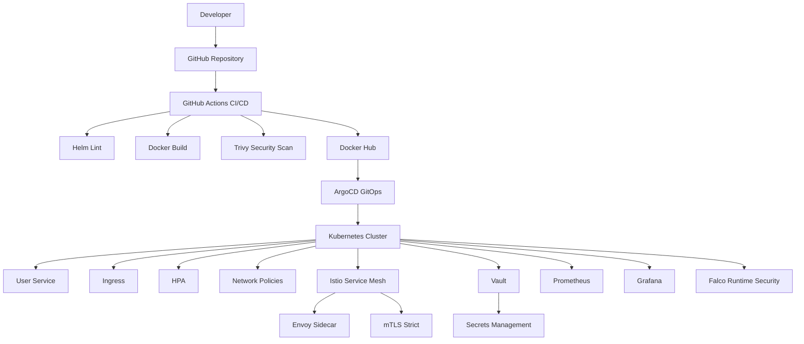

# DevSecOps Platform

## Overview

DevSecOps Platform is an end-to-end DevSecOps project demonstrating modern cloud-native deployment, security, observability, GitOps, and service mesh practices.

The project showcases how applications can be built, scanned, deployed, monitored, secured, and managed using industry-standard DevOps and DevSecOps tools.

---

## Architecture



---

## Technology Stack

### Containers & Orchestration

* Docker
* Kubernetes (Kind)
* Helm

### CI/CD

* GitHub Actions
* Docker Hub

### GitOps

* ArgoCD

### Security

* Trivy
* HashiCorp Vault
* Falco
* Kubernetes Network Policies
* Istio mTLS

### Observability

* Prometheus
* Grafana

### Service Mesh

* Istio
* Envoy Proxy

---

## Implemented Features

### Kubernetes

* Deployment
* Service
* Ingress Controller
* Horizontal Pod Autoscaler (HPA)
* Pod Disruption Budget (PDB)
* ConfigMaps
* Secrets
* Network Policies

### Helm

* Helm Chart Packaging
* Helm Install
* Helm Upgrade
* Helm Rollback

### CI/CD Pipeline

GitHub Actions pipeline performs:

1. Helm Lint
2. Docker Image Build
3. Trivy Vulnerability Scan
4. Docker Image Push

### GitOps

ArgoCD continuously monitors Git and synchronizes Kubernetes resources automatically.

Features:

* Auto Sync
* Self Heal
* Drift Detection

### Monitoring

Prometheus collects cluster metrics.

Grafana provides dashboards for:

* Node Metrics
* Pod Metrics
* Cluster Health

### Secrets Management

HashiCorp Vault is used to:

* Store application secrets
* Retrieve secrets securely
* Manage sensitive configuration

### Runtime Security

Falco is deployed for runtime security monitoring.

### Service Mesh

Istio provides:

* Sidecar Injection
* Envoy Proxy
* Mutual TLS (mTLS)
* Traffic Management

---

## Project Structure

```text
devsecops-platform
├── applications
├── cicd
│   ├── github-actions
│   └── jenkins
├── infrastructure
│   ├── eks
│   └── kind
├── kubernetes
│   ├── base
│   ├── helm
│   └── overlays
├── observability
│   ├── grafana
│   ├── prometheus
│   └── loki
├── security
│   ├── vault
│   ├── falco
│   └── policies
├── istio
├── docs
└── README.md
```

---

## Key Learning Outcomes

* Kubernetes Administration
* Helm Package Management
* GitHub Actions CI/CD
* GitOps with ArgoCD
* Container Security using Trivy
* Secrets Management with Vault
* Runtime Security using Falco
* Monitoring with Prometheus & Grafana
* Service Mesh with Istio
* Mutual TLS (mTLS)
* Production-grade DevSecOps Practices

---

## Future Enhancements

* EKS Deployment using Terraform
* Sealed Secrets
* Loki Log Aggregation
* OpenTelemetry Tracing
* Multi-Environment GitOps Deployments

```
```

