# DevSecOps Platform

## Overview

DevSecOps Platform is an end-to-end cloud-native DevSecOps project demonstrating CI/CD, GitOps, Kubernetes, Security, Service Mesh, Secrets Management, and Observability practices using modern open-source tools.

The project showcases how applications can be built, scanned, packaged, deployed, secured, monitored, and managed using industry-standard DevOps and DevSecOps technologies.

---

## Architecture

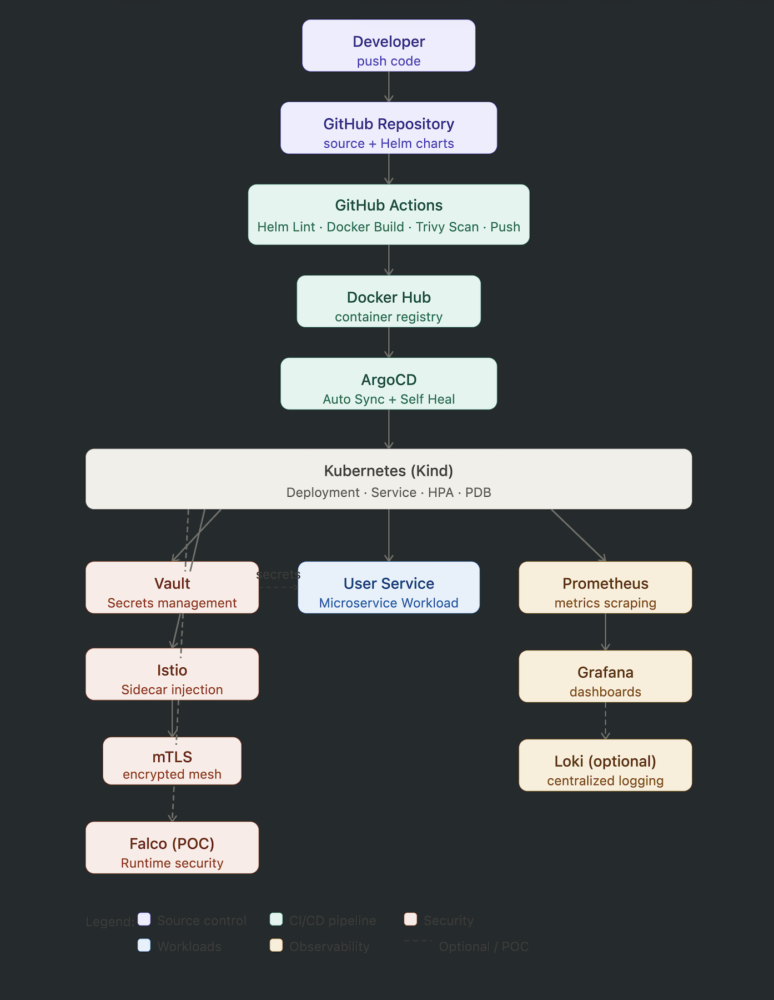

This platform follows a GitOps-driven DevSecOps workflow. Source code is stored in GitHub and validated through GitHub Actions using Helm linting, Docker image builds, and Trivy security scans. Container images are published to Docker Hub and automatically synchronized into Kubernetes using ArgoCD. Security controls include HashiCorp Vault for secrets management, Istio service mesh with mTLS, and Falco runtime security monitoring. Observability is provided through Prometheus, Grafana, and Loki.

---

## Technology Stack

### Containers & Orchestration

- Docker
- Kubernetes (Kind)
- Helm

### CI/CD

- GitHub Actions
- Docker Hub

### GitOps

- ArgoCD

### Security

- Trivy
- HashiCorp Vault
- Falco (POC)
- Kubernetes Network Policies
- Istio mTLS

### Observability

- Prometheus
- Grafana
- Loki

### Service Mesh

- Istio
- Envoy Proxy

---

## Implemented Features

### Kubernetes

- Deployment
- Service
- Horizontal Pod Autoscaler (HPA)
- Pod Disruption Budget (PDB)
- Resource Requests and Limits
- Namespace Isolation
- ConfigMaps
- Secrets
- Network Policies

### Helm

- Helm Chart Packaging
- Helm Install
- Helm Upgrade
- Helm Release Management

### CI/CD Pipeline

GitHub Actions pipeline performs:

1. Helm Lint
2. Docker Build
3. Trivy Security Scan
4. Docker Push

### GitOps

ArgoCD continuously synchronizes Kubernetes resources from Git.

Features:

- Auto Sync
- Self Heal
- Drift Detection

### Secrets Management

HashiCorp Vault is used to:

- Store application secrets
- Retrieve secrets securely
- Centralize secret management
- Reduce hardcoded credentials

### Service Mesh

Istio provides:

- Automatic Sidecar Injection
- Envoy Proxy Integration
- Mutual TLS (mTLS)
- Service-to-Service Encryption

### Monitoring & Observability

Prometheus provides:

- Metrics Collection
- Target Monitoring
- Kubernetes Metrics

Grafana provides:

- Infrastructure Dashboards
- Resource Utilization Monitoring
- Cluster Visibility

Loki provides:

- Centralized Log Aggregation (POC)

### Runtime Security

Falco has been integrated as a Proof of Concept (POC) for runtime threat detection and Kubernetes security event monitoring.

---

## Project Structure

```text
devsecops-platform
├── applications
│   ├── backend
│   ├── frontend
│   └── user-service
├── cicd
│   ├── github-actions
│   └── jenkins
├── docs
│   └── screenshots
├── infrastructure
│   ├── eks
│   └── kind
├── kubernetes
│   ├── base
│   ├── helm
│   └── overlays
├── observability
│   ├── grafana
│   ├── prometheus
│   ├── loki
│   ├── jaeger
│   └── elk
├── security
│   ├── vault
│   ├── falco
│   ├── sealed-secrets
│   └── policies
├── istio
└── README.md
```

---

## Screenshots

### Architecture


### Project Structure

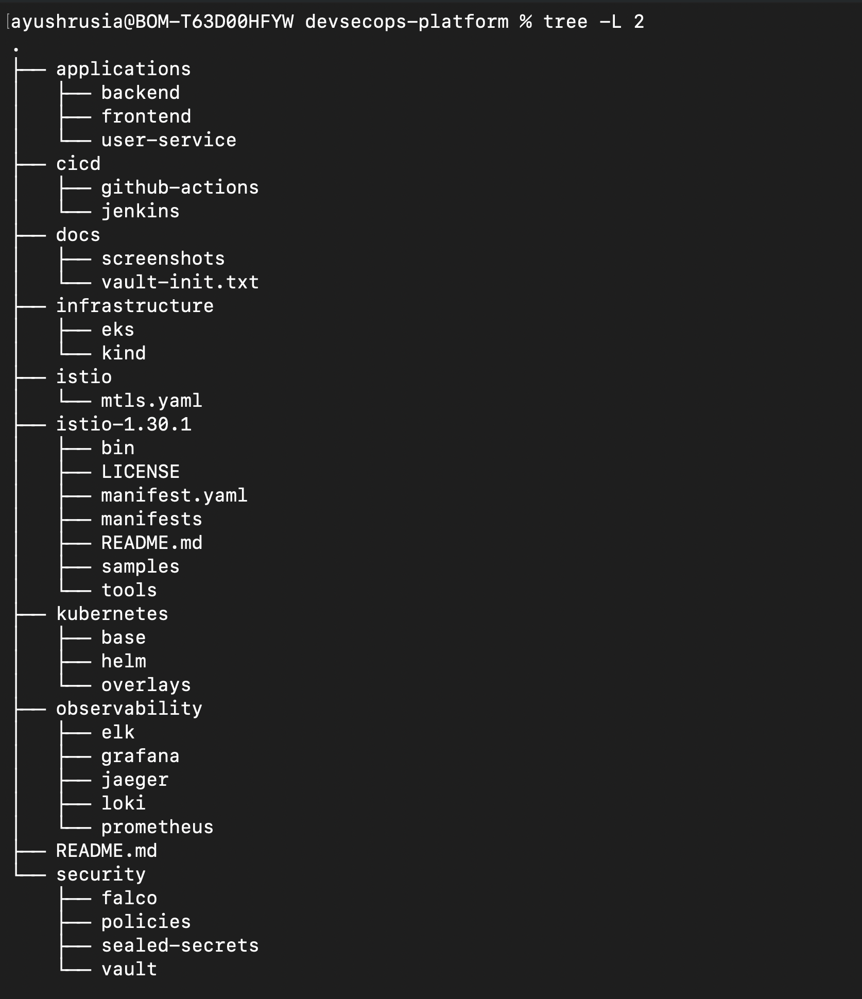

### GitHub Actions Pipeline

GitHub Actions executes Helm linting, Docker image build, Trivy scanning, and image publishing.

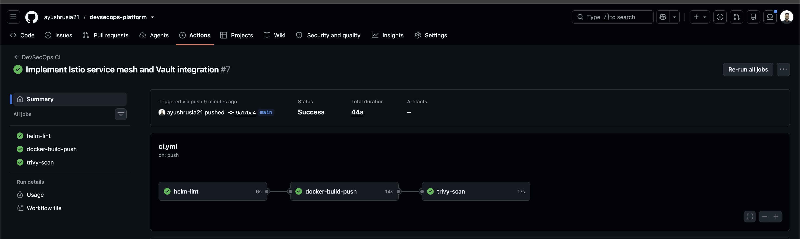

### Docker Hub Repository

Container images are automatically published to Docker Hub.

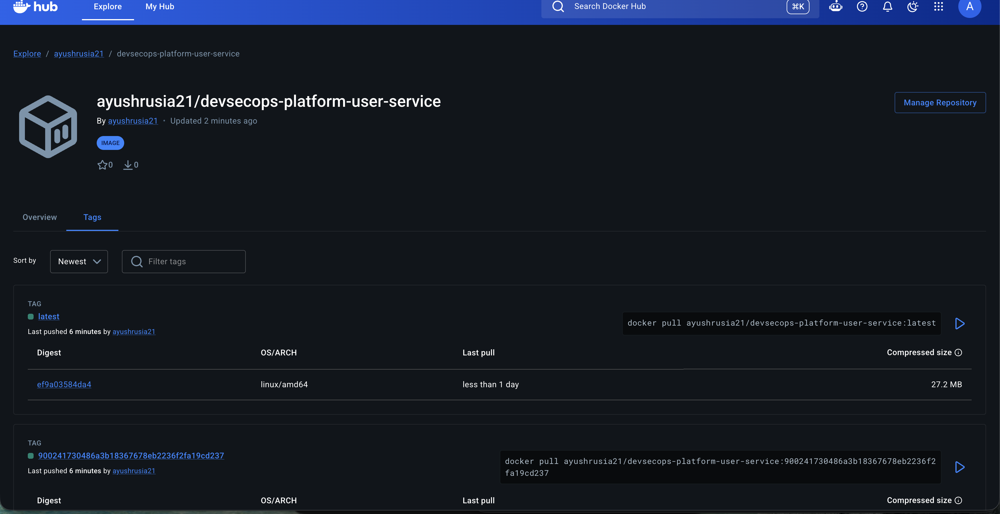

### ArgoCD GitOps Deployment

ArgoCD continuously synchronizes application manifests from GitHub.

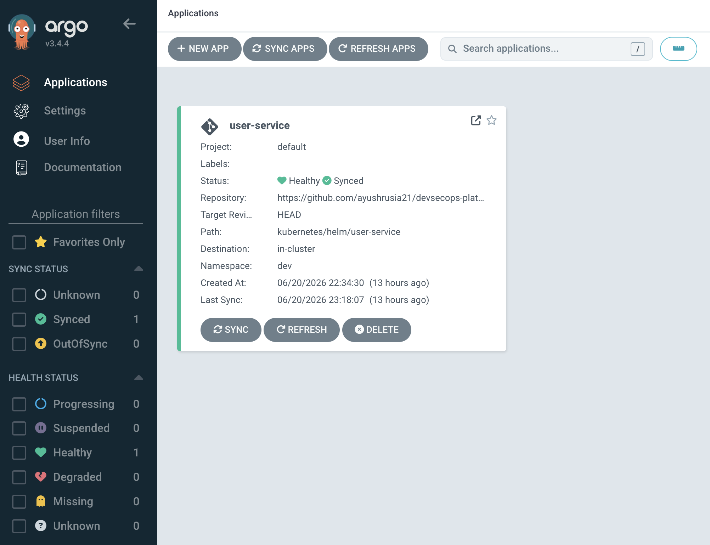

### Kubernetes Deployment

User service deployment with Kubernetes resources, HPA, and Pod Disruption Budget.

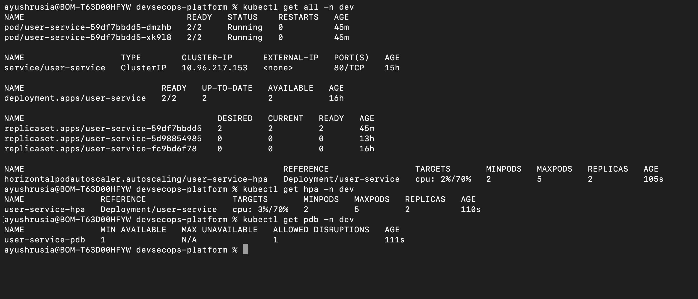

### Prometheus Monitoring

Prometheus target discovery and metrics collection.

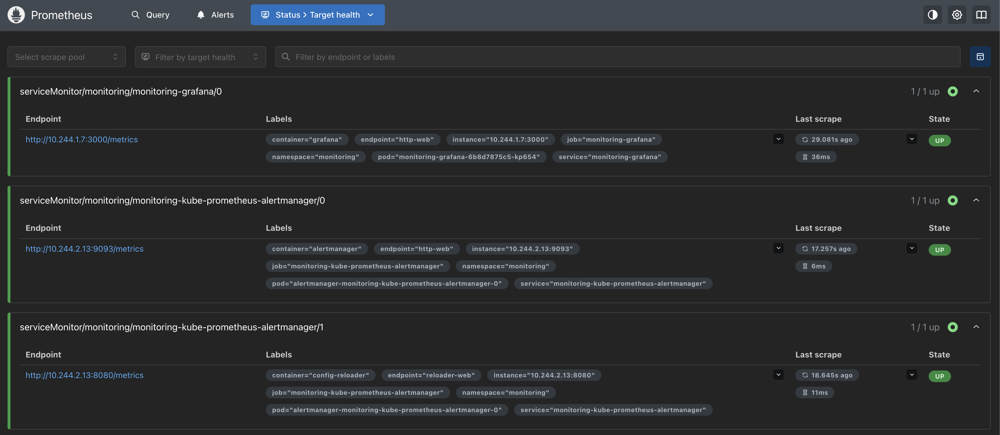

### Grafana Dashboard

Infrastructure monitoring and resource utilization dashboards.

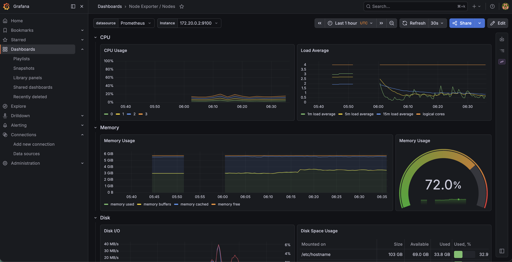

### Vault Secrets Management

Secrets securely stored and retrieved using HashiCorp Vault.

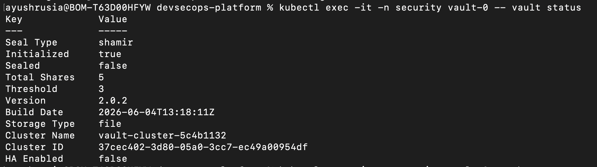

### Istio Sidecar Injection

Verification of Envoy sidecar injection into application pods.

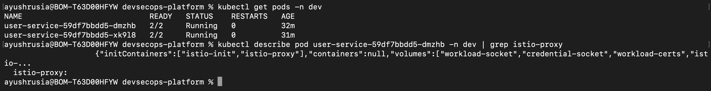

### Istio Mutual TLS

Strict mTLS enabled using Istio PeerAuthentication.

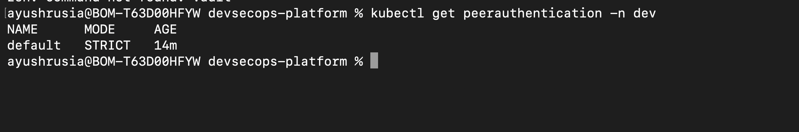

---

## CI/CD Workflow

```text
Developer
    │
    ▼
GitHub Repository
    │
    ▼
GitHub Actions
    ├── Helm Lint
    ├── Docker Build
    ├── Trivy Scan
    └── Docker Push
            │
            ▼
       Docker Hub
            │
            ▼
         ArgoCD
            │
            ▼
      Kubernetes
            │
            ▼
      User Service
```

---

## Security Controls

### Container Security

- Trivy Image Scanning
- Vulnerability Detection

### Secrets Security

- HashiCorp Vault
- Centralized Secret Storage

### Runtime Security

- Falco Runtime Monitoring (POC)

### Network Security

- Kubernetes Network Policies
- Istio mTLS Encryption

---

## Key Learning Outcomes

- Kubernetes Administration
- Helm Package Management
- GitHub Actions CI/CD
- GitOps with ArgoCD
- Docker Containerization
- Container Security with Trivy
- Secrets Management with Vault
- Service Mesh with Istio
- Mutual TLS (mTLS)
- Monitoring with Prometheus
- Dashboarding with Grafana
- Runtime Security with Falco
- Production-grade DevSecOps Practices

---

## Future Enhancements

- Terraform-based EKS Provisioning
- Sealed Secrets Integration
- Full Loki Logging Pipeline
- OpenTelemetry Integration
- Distributed Tracing with Jaeger
- Multi-Environment GitOps Deployment
- Canary Deployments using Istio
- Advanced Alerting and SLO Monitoring

---

## Author

**Ayush Rusia**

DevOps Engineer | Kubernetes | AWS | Docker | GitHub Actions | Terraform | ArgoCD | Istio | Vault | Prometheus | Grafana
